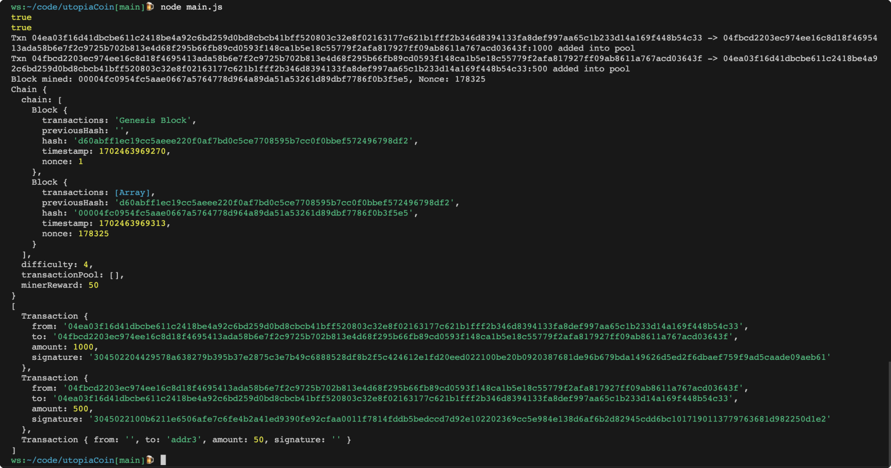

# UTOPIA COIN

## 1 Quick Start
```bash
yarn install 
node main.js
```

## 2 Result Preview


## 3 Implemented
- Manually adjust mining difficulty
- Bundled transactions
- Miner's Out of Block Bonus
- Blockchain hash verification
- Verification of legitimacy of transactions


## 4 Uncompleted
- Accepting and validating packed blocks from other nodes
- Automatically adjusts the difficulty, stabilizing the average mining time at 10 minutes
- UTXO model and locking/witness script
